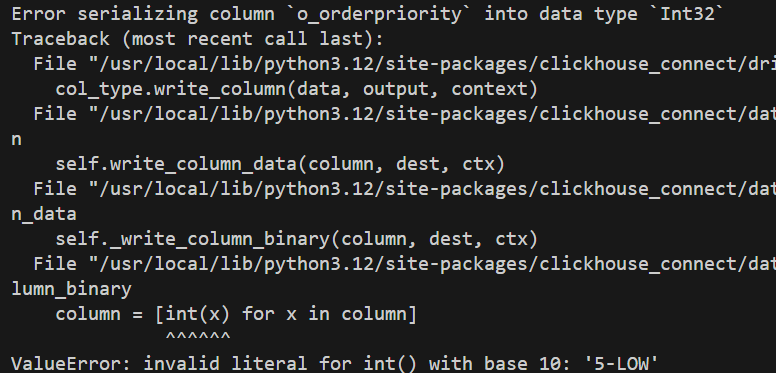
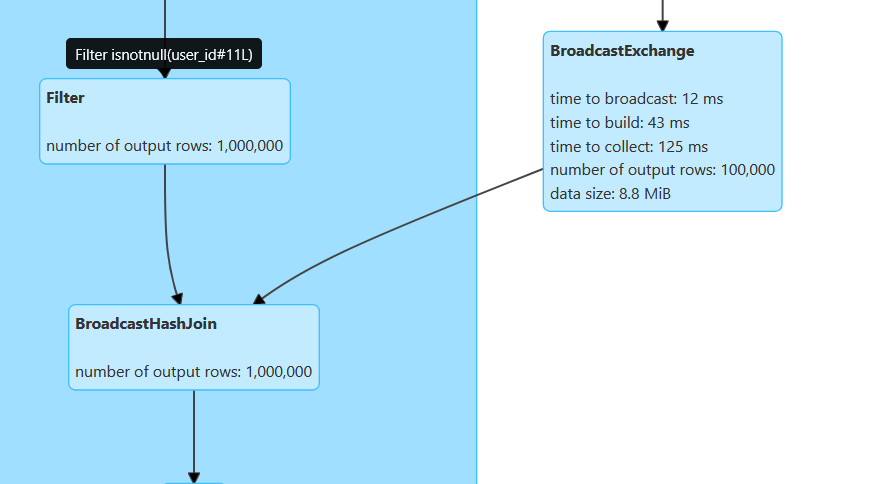
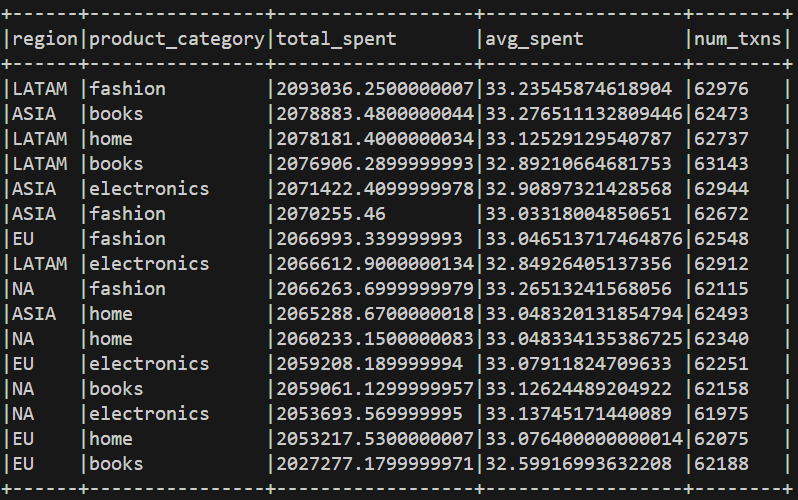
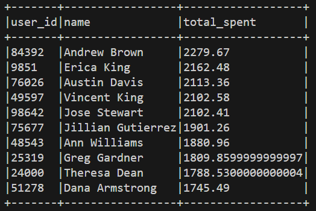

## Learn Supaku In-Depth 😂
- Subak 🍉
- SPARK IN REVERSE IS KRAPS
- [Setup](https://medium.com/@dkalouris/setting-up-spark-using-docker-59db2d073487)
- [Databricks dbgen](https://github.com/databricks/tpch-dbgen)
## TODOs
- [x] Fake gen
- [x] docker compose
- [x] do complex ops with fake
- [ ] dw vs lh experiment
    - this is where i left off

- [ ] volume QoL(local-jupyter-spark)
- [ ] optimize
    - [ ] 100 fold data
    - [ ] partitioning
    - [ ] graph shows that broadcast is automatic. see if explicit broadcast has any other effect?
    - [ ] if broadcast is not an option(both df are huge) try sortMergeJoin and bucketBy
    - [ ] use of joined.cache()
    - [ ] repartition by other column for downstream groupbys
    - [ ] column pruning (predicate pushdown at work): select only the necessary columns
    - [ ] handling already partitioned parquets
- [ ] try df.explain(True)
- [ ] helm chart packaging
- [ ] cluster deployment

This picture demonstrates that broadcast is autocast 😁

## Test results
### Notes
- data should exist on worker node as well -> add volume
### test_submission.py result
- Agg1 result

- Top spenders result
